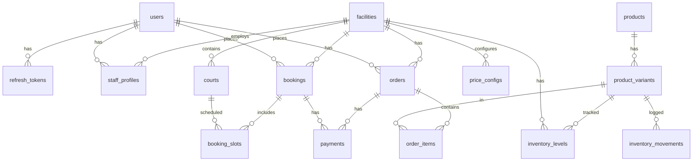

# 04 — Database Schema & Models

> **Cập nhật lần cuối:** 2026-06-19 — Đồng bộ theo code thật (T-REV-0)  
> ⚠️ File `DATA_MODEL.md` cũ đã **outdated** — thay thế bởi file này.  
> Source of truth: `backend/src/models/`

## Ghi Chú Quan Trọng

| Hạng mục | Chi tiết |
|----------|---------|
| **ORM** | Sequelize v6 — sync với `SYNC_DB=true` |
| **Đơn vị tiền** | Integer VNĐ. `amount_cents`, `total_cents`, `price_cents` = **1 unit = 1 VNĐ**. Không chia 100 khi hiển thị. |
| **Soft Delete** | Hầu hết bảng dùng `paranoid: true` (có cột `deleted_at`) |
| **Timestamps** | `created_at`, `updated_at` (Sequelize tự quản lý) |

---

## 1. Sơ Đồ ER (Tổng Quan)



---

## 2. Bảng Chi Tiết

### 2.1 `users`

| Cột | Kiểu | Ghi chú |
|-----|------|---------|
| `id` | INT PK AUTO | |
| `full_name` | VARCHAR(100) | Nullable |
| `email` | VARCHAR(100) UNIQUE | Not null |
| `phone` | VARCHAR(20) | Nullable |
| `password_hash` | VARCHAR(255) | Not null |
| `avatar_url` | VARCHAR(255) | Nullable |
| `role` | ENUM | `admin` \| `staff` \| `customer` |
| `membership_type` | ENUM | `standard` \| `student` \| `vip` — **Tồn tại nhưng chưa dùng trong business flow** |
| `loyalty_points` | INT | Default 0 — **Tồn tại nhưng chưa dùng trong business flow** |
| `is_active` | BOOLEAN | Default true |
| `created_at`, `updated_at`, `deleted_at` | DATETIME | soft delete |

---

### 2.2 `facilities`

| Cột | Kiểu | Ghi chú |
|-----|------|---------|
| `id` | INT PK AUTO | |
| `name` | VARCHAR(150) | Not null |
| `address` | VARCHAR(255) | Not null |
| `timezone` | VARCHAR(50) | Default `Asia/Ho_Chi_Minh` |
| `open_time` | TIME | Default `06:00:00` |
| `close_time` | TIME | Default `22:00:00` |
| `avatar_url` | TEXT | Nullable |
| `cancel_policy` | JSON | Nullable |
| `is_active` | BOOLEAN | Default true |
| `created_at`, `updated_at`, `deleted_at` | DATETIME | soft delete |

---

### 2.3 `courts`

| Cột | Kiểu | Ghi chú |
|-----|------|---------|
| `id` | INT PK AUTO | |
| `facility_id` | INT FK → facilities | Not null |
| `name` | VARCHAR(100) | Not null |
| `court_type` | ENUM | `badminton` \| `tennis` \| `football` \| `table_tennis` |
| `is_active` | BOOLEAN | Default true |
| `created_at`, `updated_at`, `deleted_at` | DATETIME | soft delete |

> ⚠️ **Court dùng `court_type` enum trực tiếp** — không có `court_type_id` FK đến bảng `court_types`.

---

### 2.4 `court_types`

| Cột | Kiểu | Ghi chú |
|-----|------|---------|
| Chưa audit chi tiết | — | — |

> ⚠️ **CourtType model tồn tại** trong code nhưng **không được dùng làm FK trong `courts`**.  
> Đây là bảng reference/legacy, chưa được tích hợp trong relation hiện tại.

---

### 2.5 `price_configs`

| Cột | Kiểu | Ghi chú |
|-----|------|---------|
| `id` | INT PK AUTO | |
| `facility_id` | INT FK → facilities | Not null |
| `court_type` | STRING | `badminton` \| `tennis` \| `football` \| `table_tennis` |
| `start_time` | TIME | Not null |
| `end_time` | TIME | Not null |
| `price_per_hour` | INT | Đơn vị: VNĐ (1 unit = 1 VNĐ) |
| `created_at`, `updated_at`, `deleted_at` | DATETIME | soft delete |

> ℹ️ Tên bảng thực tế: `price_configs` (docs cũ gọi nhầm là `price_rules`).

---

### 2.6 `bookings`

| Cột | Kiểu | Ghi chú |
|-----|------|---------|
| `id` | INT PK AUTO | |
| `user_id` | INT FK → users | Nullable (walk-in khách không có tài khoản) |
| `facility_id` | INT FK → facilities | Not null |
| `status` | ENUM | `pending` \| `confirmed` \| `cancelled` \| `completed` \| `no_show` |
| `payment_status` | ENUM | `unpaid` \| `partial` \| `paid` \| `refunded` |
| `payment_method` | ENUM | `cash` \| `vnpay` |
| `total_cents` | INT | Tổng tiền (VNĐ) |
| `note` | TEXT | Nullable |
| `checked_in_at` | DATETIME | Nullable |
| `cancelled_at` | DATETIME | Nullable |
| `cancel_reason` | VARCHAR(255) | Nullable |
| `created_at`, `updated_at`, `deleted_at` | DATETIME | soft delete |

> ⚠️ Booking status **không có** `checked_in` — docs cũ `BUSINESS_LOGIC.md` ghi sai.

---

### 2.7 `booking_slots`

| Cột | Kiểu | Ghi chú |
|-----|------|---------|
| `id` | INT PK AUTO | |
| `booking_id` | INT FK → bookings | Not null |
| `court_id` | INT FK → courts | Not null |
| `start_at` | DATETIME | Not null |
| `end_at` | DATETIME | Not null |
| `price_cents` | INT | Snapshot giá tại thời điểm đặt (VNĐ) |
| `created_at`, `updated_at` | DATETIME | Không có soft delete |

---

### 2.8 `products`

| Cột | Kiểu | Ghi chú |
|-----|------|---------|
| `id` | INT PK AUTO | |
| `name` | VARCHAR | Not null |
| `slug` | VARCHAR UNIQUE | Not null |
| `category` | VARCHAR | `racket` \| `shuttlecock` \| `shoes` \| `apparel` \| `accessory` (từ code) |
| `description` | TEXT | Nullable |
| `thumbnail_url` | TEXT | Nullable |
| `rating` | DECIMAL | Nullable |
| `review_count` | INT | Nullable |
| `is_active` | BOOLEAN | Default true |
| `created_at`, `updated_at`, `deleted_at` | DATETIME | soft delete |

---

### 2.9 `product_variants`

| Cột | Kiểu | Ghi chú |
|-----|------|---------|
| `id` | INT PK AUTO | |
| `product_id` | INT FK → products | |
| `sku` | VARCHAR UNIQUE | |
| `attributes` | JSON | VD: `{ "size": "3U", "color": "Red" }` |
| `price_cents` | INT | Đơn vị: VNĐ |
| `barcode` | VARCHAR | Nullable |
| `is_active` | BOOLEAN | |
| `created_at`, `updated_at`, `deleted_at` | DATETIME | soft delete |

---

### 2.10 `orders`

| Cột | Kiểu | Ghi chú |
|-----|------|---------|
| `id` | INT PK AUTO | |
| `user_id` | INT FK → users | Nullable |
| `facility_id` | INT FK → facilities | Not null |
| `status` | ENUM | `pending_payment` \| `pending_pickup` \| `completed` \| `cancelled` \| `refunded` \| `expired` |
| `total_cents` | INT | Tổng tiền (VNĐ) |
| `note` | TEXT | Nullable |
| `pickup_type` | ENUM | `immediate` \| `pickup_store` |
| `pickup_time` | DATETIME | Nullable |
| `reservation_expires_at` | DATETIME | Nullable |
| `created_at`, `updated_at`, `deleted_at` | DATETIME | soft delete |

> ⚠️ Order status thực tế: `pending_payment | pending_pickup | completed | cancelled | refunded | expired`  
> Docs cũ ghi sai: `pending | processing | completed | cancelled`

---

### 2.11 `order_items`

| Cột | Kiểu | Ghi chú |
|-----|------|---------|
| `id` | INT PK AUTO | |
| `order_id` | INT FK → orders | |
| `variant_id` | INT FK → product_variants | |
| `quantity` | INT | |
| `unit_price_cents` | INT | Snapshot giá lúc mua (VNĐ) |

---

### 2.12 `payments`

| Cột | Kiểu | Ghi chú |
|-----|------|---------|
| `id` | INT PK AUTO | |
| `provider` | ENUM | `cash` \| `vnpay` |
| `status` | ENUM | `pending` \| `paid` \| `failed` \| `refunded` |
| `amount_cents` | INT | Số tiền (VNĐ, 1 unit = 1 VNĐ) |
| `booking_id` | INT FK → bookings | Nullable (payment cho booking) |
| `order_id` | INT FK → orders | Nullable (payment cho order) |
| `provider_ref` | VARCHAR(255) | Nullable (VNPay transaction ref) |
| `metadata` | JSON | Nullable |
| `paid_at` | DATETIME | Nullable |
| `created_at`, `updated_at` | DATETIME | |

> ℹ️ Một payment thuộc về **một** booking HOẶC **một** order (không cả hai).  
> ℹ️ Provider docs cũ ghi `manual_transfer | sandbox | momo | vnpay` là **sai** — thực tế chỉ `cash | vnpay`.

---

### 2.13 `inventory_levels`

| Cột | Kiểu | Ghi chú |
|-----|------|---------|
| `id` | INT PK AUTO | |
| `variant_id` | INT FK → product_variants | UNIQUE per (variant_id, facility_id) |
| `facility_id` | INT FK → facilities | |
| `quantity_on_hand` | INT | |

---

### 2.14 `inventory_movements`

| Cột | Kiểu | Ghi chú |
|-----|------|---------|
| `id` | INT PK AUTO | |
| `variant_id` | INT FK → product_variants | |
| `facility_id` | INT FK → facilities | |
| `qty_delta` | INT | Số lượng thay đổi (âm = xuất, dương = nhập) |
| `reason` | ENUM | `sale` \| `return` \| `adjustment` \| `import` \| `transfer_in` \| `transfer_out` \| `sync` |
| `ref_order_id` | INT | Nullable |
| `note` | TEXT | Nullable |
| `created_at`, `updated_at` | DATETIME | |

---

### 2.15 `staff_profiles`

| Cột | Kiểu | Ghi chú |
|-----|------|---------|
| `id` | INT PK AUTO | |
| `user_id` | INT FK → users | |
| `facility_id` | INT FK → facilities | |
| `job_title` | VARCHAR | |
| `is_active` | BOOLEAN | |
| `created_at`, `updated_at` | DATETIME | |

---

### 2.16 `refresh_tokens`

| Cột | Kiểu | Ghi chú |
|-----|------|---------|
| `id` | INT PK AUTO | |
| `user_id` | INT FK → users | |
| `token_hash` | VARCHAR | Hash của refresh token |
| `expires_at` | DATETIME | |
| `revoked` | BOOLEAN | Default false |
| `created_at` | DATETIME | |

---

### 2.17 `holidays`

| Cột | Kiểu | Ghi chú |
|-----|------|---------|
| `id` | INT PK AUTO | |
| `name` | VARCHAR(255) | Not null |
| `holiday_date` | DATEONLY (YYYY-MM-DD) | UNIQUE |
| `surcharge_percent` | INT | % phụ thu ngày lễ (VD: 50 = +50%) |
| `created_at`, `updated_at`, `deleted_at` | DATETIME | soft delete |

---

### 2.18 `system_configs`

| Cột | Kiểu | Ghi chú |
|-----|------|---------|
| `id` | INT PK AUTO | |
| `key` | VARCHAR(100) UNIQUE | Not null |
| `value` | VARCHAR(255) | Lưu dạng string dù là số hay boolean |
| `description` | TEXT | Nullable |
| `data_type` | ENUM | `number` \| `string` \| `boolean` |
| `created_at`, `updated_at`, `deleted_at` | DATETIME | soft delete |

---

### 2.19 `audit_logs`

| Cột | Kiểu | Ghi chú |
|-----|------|---------|
| `id` | INT PK AUTO | |
| `actor_user_id` | INT | |
| `action` | STRING | |
| `entity_type` | STRING | |
| `entity_id` | INT | |
| `payload` | JSON | |
| `ip_address` | STRING | |
| `created_at` | DATETIME | |

---

## 3. Associations (Quan Hệ)

```
User ──< RefreshToken
User ──< StaffProfile >── Facility
User ──< Booking
User ──< Order

Facility ──< Court
Facility ──< PriceConfig
Facility ──< Booking
Facility ──< Order
Facility ──< InventoryLevel
Facility ──< StaffProfile

Booking ──< BookingSlot >── Court
Booking ──< Payment

Order ──< OrderItem >── ProductVariant
Order ──< Payment

Product ──< ProductVariant
ProductVariant ──< InventoryLevel
ProductVariant ──< InventoryMovement
ProductVariant ──< OrderItem
```

---

## 4. Phân Quyền Dữ Liệu

| Dữ liệu | admin | staff |
|---------|-------|-------|
| users | Toàn quyền | Tìm kiếm theo phone |
| facilities | Toàn quyền | Đọc + soft delete |
| courts | Toàn quyền | ❌ |
| bookings | Toàn quyền | CRUD |
| price_configs | Toàn quyền | ❌ |
| orders | Toàn quyền | CRUD |
| payments | Toàn quyền | pay-cash |
| products | Toàn quyền | Đọc + search |
| inventory | Toàn quyền | Đọc |
| holidays | Toàn quyền | ❌ |
| system_configs | Toàn quyền | ❌ |
| **revenue** | **Chỉ admin** | **❌** |
