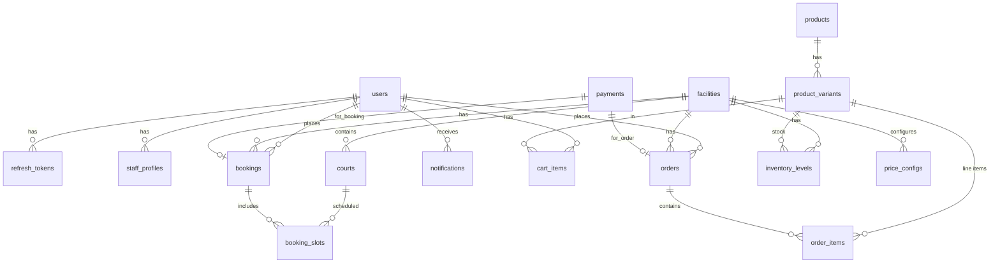

# Mô hình dữ liệu (ER, Bảng, Index, Phân quyền) - Bản Final

## 1. Sơ đồ ER (Mermaid)

## 2. Bảng và Mục đích

### 2.1 Người dùng & Nhân viên

| Bảng | Cột chính | Mô tả |
|------|-----------|-------|
| `users` | id, full_name, email, phone, password_hash, avatar_url, role (`admin`\|`staff`\|`customer`), loyalty_points, is_active, created_at, deleted_at | Tài khoản toàn hệ thống. Hỗ trợ Soft Delete. |
| `staff_profiles` | id, user_id, facility_id (nullable → toàn hệ thống), job_title, is_active, created_at | Thông tin nhân viên theo cơ sở. |
| `refresh_tokens` | id, user_id, token_hash, expires_at, revoked, created_at | Lưu trữ refresh token JWT. Phục vụ thu hồi token khi đăng xuất. |

### 2.2 Cơ sở & Sân

| Bảng | Cột chính | Mô tả |
|------|-----------|-------|
| `facilities` | id, name, address, timezone, open_time, close_time, avatar_url, cancel_policy (JSON), is_active, created_at, deleted_at | Chi nhánh / cơ sở thể thao. |
| `courts` | id, facility_id, name, court_type (`badminton`\|`tennis`\|`football`), is_active, created_at, deleted_at | Sân cụ thể trong cơ sở. Không cần join bảng rườm rà. |

### 2.3 Giá theo khung giờ (Dynamic Pricing)

| Bảng | Cột chính | Mô tả |
|------|-----------|-------|
| `price_configs` | id, facility_id, court_type, start_time (TIME), end_time (TIME), price_per_hour, created_at, deleted_at | Cấu hình giá thông minh áp dụng theo loại sân và khung giờ tại cơ sở. |

### 2.4 Đặt sân (Booking)

| Bảng | Cột chính | Mô tả |
|------|-----------|-------|
| `bookings` | id, user_id (nullable = walk-in), facility_id, status (`pending`\|`confirmed`\|`cancelled`\|`completed`\|`no_show`), payment_status (`unpaid`\|`partial`\|`paid`\|`refunded`), total_cents, note, promo_code_id, checked_in_at, cancelled_at, cancel_reason, created_at | Đơn đặt sân (Header). Quản lý trạng thái tổng và tổng tiền thanh toán. |
| `booking_slots` | id, booking_id, court_id, start_at (Datetime), end_at (Datetime), price_cents | Từng ca/khung giờ nhỏ trong một đơn đặt sân. |

### 2.5 Sản phẩm & Đơn hàng (Bán lẻ)

| Bảng | Cột chính | Mô tả |
|------|-----------|-------|
| `products` | id, name, slug, category, description, thumbnail_url, rating, review_count, is_active, created_at | Sản phẩm bán lẻ chung. |
| `product_variants` | id, product_id, sku (UNIQUE), ATTRS (JSON: size, color), price_cents, barcode, is_active, created_at | Biến thể sản phẩm chi tiết. |
| `cart_items` | id, user_id, variant_id, quantity, created_at, updated_at | Giỏ hàng server-side. UNIQUE `(user_id, variant_id)`. |
| `orders` | id, user_id, facility_id, status (`pending`\|`confirmed`\|`completed`\|`cancelled`\|`refunded`), payment_method, subtotal_cents, discount_cents, total_cents, note, created_at | Đơn hàng mua sản phẩm tại cơ sở. |
| `order_items` | id, order_id, variant_id, quantity, unit_price_cents, discount_cents | Dòng sản phẩm trong đơn; lưu snapshot giá lúc mua. |

### 2.6 Quản lý Tồn kho

| Bảng | Cột chính | Mô tả |
|------|-----------|-------|
| `inventory_levels` | id, variant_id, facility_id, quantity_on_hand; UNIQUE `(variant_id, facility_id)` | Quản lý số lượng tồn kho thực tế của từng mặt hàng tại cơ sở. |
| `inventory_movements` | id, variant_id, facility_id, qty_delta, reason (`sale`\|`return`\|`adjustment`\|`import`), ref_order_id, note, created_at | Lưu lịch sử nhập/xuất kho để đối soát. |

### 2.7 Khuyến mãi & Thanh toán

| Bảng | Cột chính | Mô tả |
|------|-----------|-------|
| `promo_codes` | id, code (UNIQUE), type (`percent`\|`fixed`), value, min_order_cents, max_uses, used_count, expires_at, is_active, created_at | Mã giảm giá cho đặt sân hoặc mua hàng. |
| `payments` | id, provider (`manual_transfer`\|`sandbox`\|`momo`\|`vnpay`), status (`pending`\|`paid`\|`failed`\|`refunded`), amount_cents, booking_id (nullable), order_id (nullable), provider_ref, metadata (JSON), paid_at, created_at | Giao dịch thanh toán (Dùng chung Booking & Order). |

### 2.8 Hệ thống & Log

| Bảng | Cột chính | Mô tả |
|------|-----------|-------|
| `notifications` | id, user_id, type (`booking_confirmed`\|`booking_reminder`\|`order_status`\|`promotion`), title, body, is_read, ref_type, ref_id, created_at | Thông báo đẩy trên App. |
| `audit_logs` | id, actor_user_id, action, entity_type, entity_id, payload (JSON), ip_address, created_at | Nhật ký hệ thống dùng để điều tra lỗi hoặc log hành động Admin. |

---

## 3. Các Index cực kỳ quan trọng (MySQL)

Bắt buộc phải tạo các khóa này để đảm bảo hiệu năng khi App scale:

| Index / Constraints | Mục đích |
|---------------------|----------|
| `booking_slots (start_at, end_at)` | Lọc nhanh các khoảng thời gian bị kẹt lịch (Overlapping Time). |
| `inventory_levels_variant_id_facility_id` (UNIQUE) | Mỗi sản phẩm tại một cơ sở chỉ có 1 dòng tồn kho tổng. |
| `product_variants (sku)` (UNIQUE) | Tra cứu nhanh mã vạch lúc quét mã tính tiền. |
| `users (email)` & `users (phone)` (UNIQUE) | Tránh tạo trùng tài khoản. |
| `bookings (facility_id, status)` | Để Staff load danh sách đặt sân hôm nay siêu tốc. |

### Giải pháp chống Double Booking (Chặn đặt trùng giờ)
Vì MySQL không có Exclusion Constraint, hệ thống kết hợp 2 lớp phòng thủ:
1. **Lọc từ xa:** API `getAvailableCourts` lọc chặn giờ trùng trên giao diện người dùng.
2. **Transaction DB:** Bọc toàn bộ logic tạo Booking trong `sequelize.transaction()`, dùng Lock Row (nếu cần thiết) trước khi Insert slot mới ở tầng Backend.

---

## 4. Phân quyền dữ liệu ở tầng ứng dụng (Node.js)

| Dữ liệu (Bảng) | Customer (Mobile App) | Staff (Web Lễ tân) | Admin (Web Tổng) |
|-----------------|----------------|--------------------|------------------|
| `users` | Chỉ xem/sửa profile của mình | Đọc thông tin user đang đặt sân | Toàn quyền |
| `bookings` | Chỉ xem lịch của mình | Quản lý toàn bộ lịch ở cơ sở (facility) đang trực | Toàn quyền |
| `orders` | Chỉ xem đơn của mình | Lên đơn, bán hàng tại cơ sở trực | Toàn quyền |
| `price_configs` | Gọi ẩn qua API tính tiền | Chỉ xem | Thêm/Sửa/Xóa |
| `inventory_levels`| Không truy cập | Check tồn kho bán hàng tại cơ sở | Quản lý kho tổng |